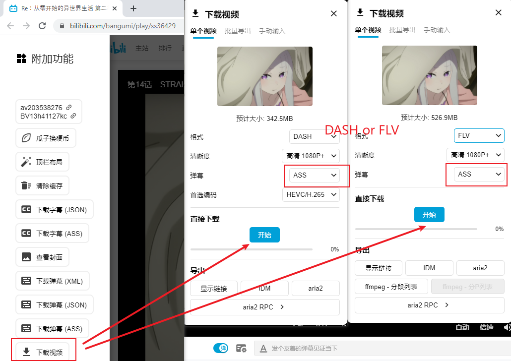
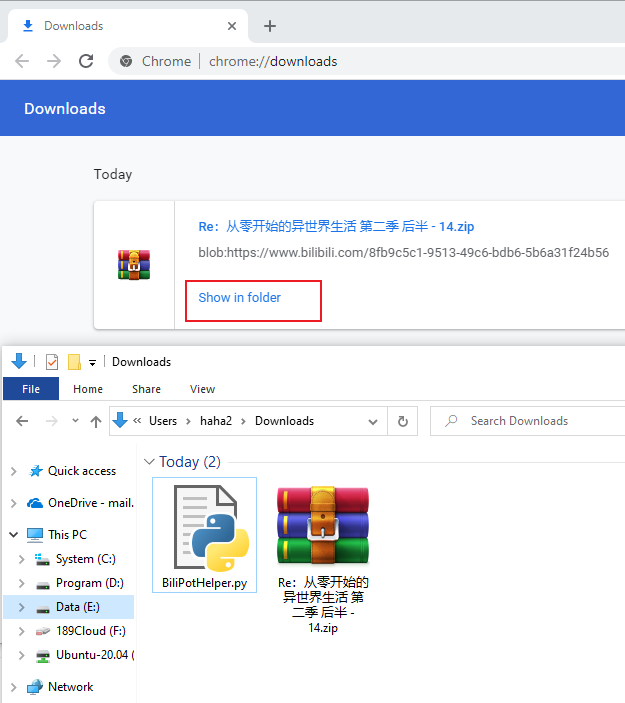
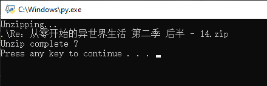
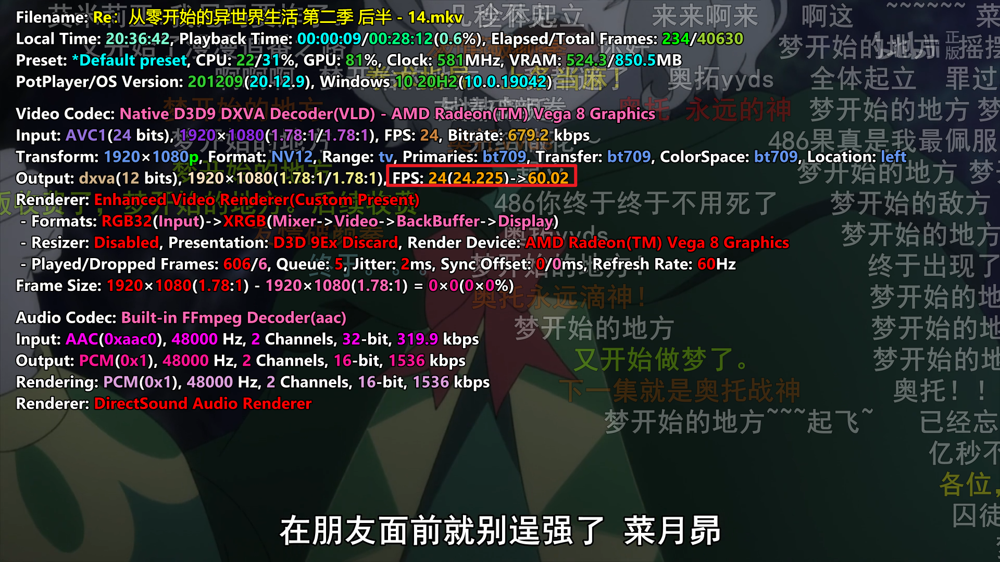
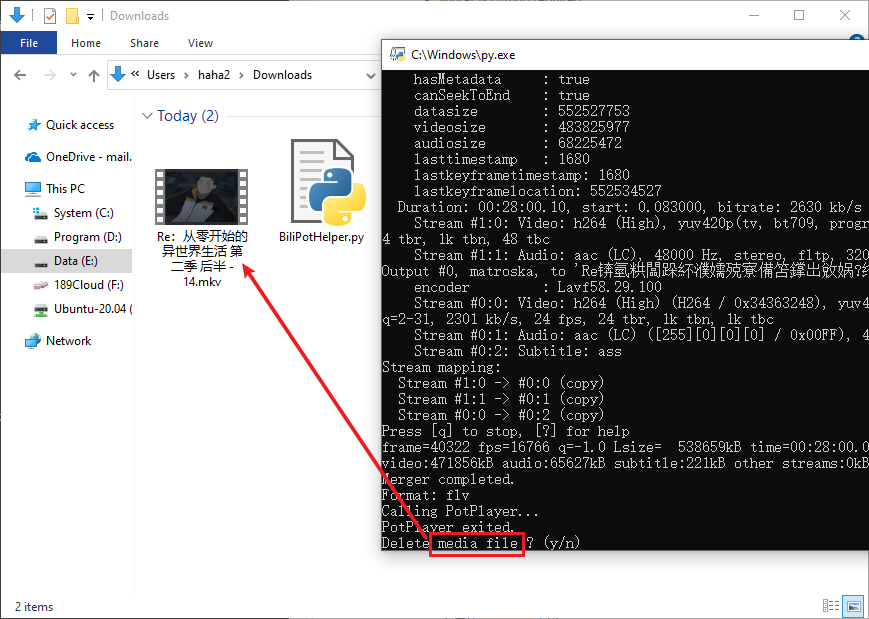

# BiliPotHelper
Play bilibili bangumi(danmaku&amp;60FPS) with PotPlayer.

## Before using:
* Make sure you have installed [PotPlayer](http://potplayer.daum.net/) and Rate Converter Software (like [BFRC](https://bluesky-soft.com/en/BlueskyFRC.html)).
* Add *:\Program Files\DAUM\PotPlayer to `PATH`.
* Download [ffmpeg](https://ffmpeg.org/download.html#build-windows) and add it to `PATH`.
* winrar & python are required.
* Add [Bilibili-Evolved](https://github.com/the1812/Bilibili-Evolved) to your chrome's tampermonkey.

## Usage:
* Download a bangumi first.
* Make sure BiliPotHelper.py and the ZIP are in the same path.
* Run BiliPotHelper.py
* When upzipping completed, press anykey to call PotPlayer.
* Enjoy it ! 
* When the bangumi is finished(PotPlayer exited), you can chose  whether to delete the media file.

## Thanks:
* [Bilibili-Evolved](https://github.com/the1812/Bilibili-Evolved)
